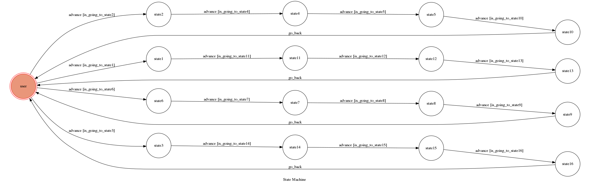

# TOC Project 2017

Template Code for TOC Project 2017

A telegram bot based on a finite state machine

## Setup

### Prerequisite
* Python 2

#### Install Dependency
```sh
pip install -r requirements.txt
```

* pygraphviz (For visualizing Finite State Machine)
    * [Setup pygraphviz on Ubuntu](http://www.jianshu.com/p/a3da7ecc5303)

### Secret Data

`API_TOKEN` and `WEBHOOK_URL` in app.py **MUST** be set to proper values.
Otherwise, you might not be able to run your code.

### Run Locally
You can either setup https server or using `ngrok` as a proxy.

**`ngrok` would be used in the following instruction**

```sh
ngrok http 5000
```

After that, `ngrok` would generate a https URL.

You should set `WEBHOOK_URL` (in app.py) to `your-https-URL/hook`.

#### Run the sever

```sh
python app.py
```


## Finite State Machine


## Usage
The initial state is set to `user`.

Every time `user` state is triggered to `advance` to another state, it will `go_back` to `user` state after the bot replies corresponding message.

* user
	* Input: "1"
		* Reply: "I'm entering state1"
	* Input: "11"
		* Reply: "I'm entering state11"
	* Input: "12"
		* Reply: "I'm entering state12"
	* Input: "13"
		* Reply: "I'm entering state13"
        * Go back to user
* user			
    * Input: "2"
		* Reply: "I'm entering state2"
	* Input: "4"
		* Reply: "I'm entering state4"
	* Input: "5"
		* Reply: "I'm entering state5"
	* Input: "10"
		* Reply: "I'm entering state10"
        * Go back to user
* user			
    * Input: "6"
		* Reply: "I'm entering state6"
	* Input: "7"
		* Reply: "I'm entering state7"
	* Input: "8"
		* Reply: "I'm entering state8"
	* Input: "9"
		* Reply: "I'm entering state9"
        * Go back to user
* user			
    * Input: "3"
		* Reply: "I'm entering state3"
	* Input: "14"
		* Reply: "I'm entering state14"
	* Input: "15"
		* Reply: "I'm entering state15"
	* Input: "16"
		* Reply: "I'm entering state16"
        * Go back to user
## Author
[鄭宇昇](https://github.com/64036279/TOC-Project-2017)
